# Ray tracing in a weekend 

https://raytracing.github.io/books/RayTracingInOneWeekend.html#overview

## Simple sphere

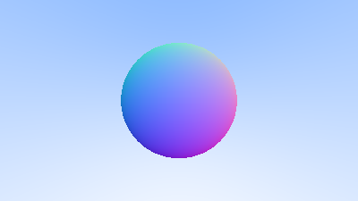

## Two spheres

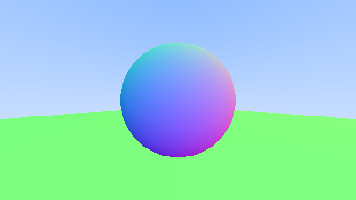

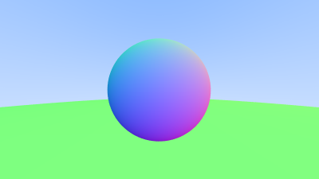

## Diffuse

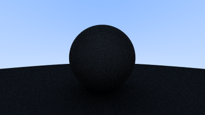

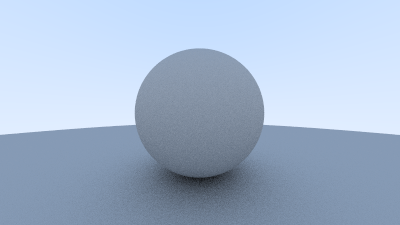

## Metal

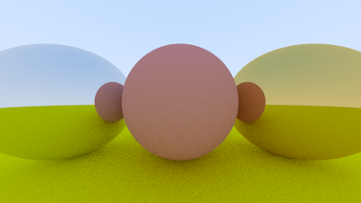

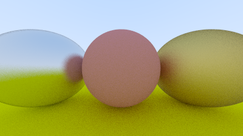

## Glass

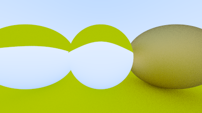

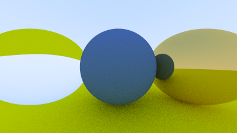

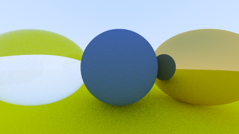
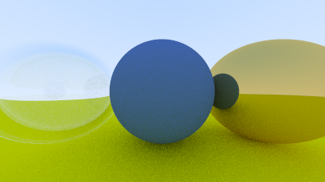

## Camera

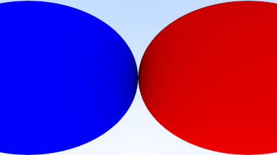
